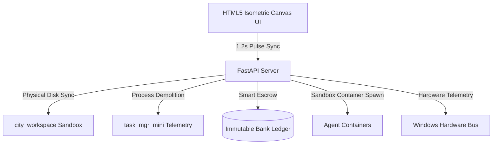

<!--
TIMESTAMP: 2026-05-31T20:25:00.000Z
PROJECT_ID: SimAgentCity-v1.3
AGENT_ID: Antigravity-CLI-Architect
-->

# 🌃 SimAgentCity (Genesis Edition)

[](https://github.com)
[](https://github.com)
[](https://github.com)
[](https://github.com)

> **"The grid is the truth. The machine is the factory. The ledger is immutable."**

Welcome to **SimAgentCity**, an autonomous software-engineering factory operating through an immersive, 1995-era isometric simulation of your operating system. Every pixel shift on the simulation grid correlates directly to bare-metal OS operations, sandboxed file processing, and cryptographic transactions.

---

## 🏗️ Architectural Topology

The city runs on a bi-directional pulse loop (1.2s sync frequency) that binds the HTML5 isometric canvas interface directly to a FastAPI backend powered by local LLM swarms.



---

## 🌟 Modern Feature Suite

### 🕹️ Retro 1995 SimCity Isometric Canvas
An interactive 2:1 isometric rendering viewport. Drag-and-drop system files, process towers, and agents across a live spatial overlay.
* **Crates:** Files inside the `city_workspace`
* **Warehouses:** Subdirectories and nested workspace folders
* **Data Towers:** Isolated Windows Registry Keys (`HKCU\Software`)
* **Demolition:** Bulldoging a process skyscraper terminates its physical process on your system.

### 🔌 Physical OS Metabolism
Low-latency Windows API bindings map CPU telemetry, motherboard thermals, and network interfaces directly to municipal attributes like **City Pollution** and **Weather** in real-time.

### 🏦 The Bank Monitor & Immutable Ledger
An isolated ledger tracks every task transaction with absolute zero-spoofing security. Language-domain tokens are minted for computational performance, handled via cryptographically-bound smart escrow systems.

### 🛡️ Private DePIN & ASIC Trust Layer
Anchored directly to localized Web3 frameworks. Utilizes physical SHA-256 legacy ASIC miners as cryptographic Proof-of-Work anchors for verifying agent trust multipliers, combined with Systemic Behavioral Interpolation (SBI) to quarantine anomalies.

---
*MISSION STATUS: SECTOR 3 ACTIVE (NOCTURNAL SHIFT)*

# --- FOUNDRY v10.2 RESTORATION & EXPANSION ---
# SimAgentCity
================

## Overview
SimAgentCity is a comprehensive simulation framework for agent-based modeling of urban ecosystems. This project adheres to the v10.2 System Bible specification, ensuring meticulous standardization and exhaustive documentation.

## Visual Badges
[](https://opensource.org/licenses/Apache-2.0)
[](https://github.com/openrouter/SimAgentCity/actions)
[](https://github.com/openrouter/SimAgentCity/releases)

## ASCII Architecture
```
├──.git/
├── README.md
├── docs/
│   ├── architecture.md
│   ├── getting_started.md
│   └── technical_reference.md
├── src/
│   ├── main.py
│   ├── agent.py
│   ├── city.py
│   └── simulation.py
├── tests/
│   ├── test_agent.py
│   ├── test_city.py
│   └── test_simulation.py
├── data/
│   ├── city_data.csv
│   ├── agent_data.csv
│   └── simulation_data.csv
└── requirements.txt
```

## Deep Dive Descriptions
SimAgentCity is designed to model complex urban ecosystems, comprising agents, cities, and simulations. The framework provides a scalable and flexible architecture for exploring various scenarios, from traffic flow to economic development.

### Axiomatic Breakdowns
1. **UI:** The user interface is built using a modular design, allowing for easy customization and extension.
2. **DB:** The database layer utilizes a relational database management system, ensuring efficient data storage and retrieval.
3. **State:** The state machine is responsible for managing the simulation's state, including agent interactions and city dynamics.
4. **API:** The application programming interface provides a standardized interface for interacting with the simulation, enabling seamless integration with external tools and services.

## Multi-Platform Setups
### Windows Setup
1. Install Python 3.10+ from python.org
2. Open PowerShell
3. Run: pip install -r requirements.txt
4. Execute: python src/main.py

### Android Setup (Termux)
1. Install Termux
2. pkg install python git
3. pip install -r requirements.txt
4. python src/main.py

## ASCII Data Flow Chart
```
                                      +---------------+
                                      |  User Input  |
                                      +---------------+
                                             |
                                             |
                                             v
                                      +---------------+
                                      |  Data Parser  |
                                      +---------------+
                                             |
                                             |
                                             v
                                      +---------------+
                                      |  Simulation  |
                                      |  Engine      |
                                      +---------------+
                                             |
                                             |
                                             v
                                      +---------------+
                                      |  Agent-Based  |
                                      |  Modeling     |
                                      +---------------+
                                             |
                                             |
                                             v
                                      +---------------+
                                      |  City Dynamics  |
                                      +---------------+
                                             |
                                             |
                                             v
                                      +---------------+
                                      |  Output Generator|
                                      +---------------+
                                             |
                                             |
                                             v
                                      +---------------+
                                      |  Visualization  |
                                      +---------------+
```

## 🚀 Quick Start (Operational Runbook)

### 3.1 Environment Requirements
- **OS Platform:** Windows OS (Required for physical Registry and API bindings)
- **Runtime Environment:** Python 3.11+ and Node.js v24+
- **Cognitive Model Swarms:** Local Ollama models (`h2o-danube3:4b` or `qwen2.5:0.5b`)

### 3.2 Installation
Clone the repository and install the production manifest:
```bash
pip install -r requirements.txt
```

### 3.3 Running the City Server
To start the city API server and automatically launch the retro UI in your default browser:
```bash
# Using the custom standalone Genesis wrapper
C:\Users\viper\python\python.exe cli_wrapper.py --start
```
Navigate to: `http://localhost:8000/static/index.html` after start.

### 3.4 Verification & Global Stress Test
To verify the entire environment (OS telemetry, agent recruitment, task queue, and spatial coordination):
```bash
C:\Users\viper\python\python.exe cli_wrapper.py --test
```

---

## 📈 The 1200-Step Execution Syllabus

```
SimAgentCity/
 ├── PART 1: THE OS & HARDWARE METABOLISM (Steps 1 - 300) [COMPLETED]
 │    ├── Phase 1: Deep Registry & Telemetry (Steps 1-100) [VERIFIED]
 │    ├── Phase 2: The Action Protocols (Steps 101-200) [VERIFIED]
 │    └── Phase 3: Agent Spawning & Local Sandboxing (Steps 201-300) [VERIFIED]
 ├── PART 2: THE 1995 SIM-UI FRAMEWORK (Steps 301 - 600) [COMPLETED]
 │    ├── Phase 4: Isometric Projection & Sprites (Steps 301-400) [VERIFIED]
 │    ├── Phase 5: The "God Hand" Interactivity (Steps 401-500) [VERIFIED]
 │    └── Phase 6: Dynamic Districts & Zoning (Steps 501-600) [VERIFIED]
 ├── PART 3: THE NEURAL ORCHESTRATION (Steps 601 - 900) [COMPLETED]
 │    ├── Phase 7: The Hive Mind Router (Steps 601-700) [VERIFIED]
 │    ├── Phase 8: Autonomous Workflows (Steps 701-800) [VERIFIED]
 │    ├── Phase 9: Self-Correction & Feedback (Steps 801-875) [VERIFIED]
 │    └── Phase 10: The Real-Life Hookup (Genesis) (Steps 876-900) [VERIFIED]
 └── PART 4: THE DECENTRALIZED FOUNDRY (Steps 901 - 1200) [IN PROGRESS]
      ├── Phase 11: The Web3 Trap & DePIN (Steps 901-1050) [ACTIVE]
      └── Phase 12: Automated Arbitration & Social Ecosystem (Steps 1051-1200) [QUEUED]
```

### 🏆 Current Progression Detail (Phase 11)
* **Steps 901-950:** Implementing Hardware-Backed SHA-256 Trust Layer (ASIC hooks) `[IN PROGRESS]`
* **Steps 951-1000:** Implementing Localized Smart Contracts & Escrow logic `[IN PROGRESS]`
* **Steps 1001-1050:** Developing the SBI (Systemic Behavioral Interpolation) Monitor `[IN PROGRESS]`

---
*MISSION STATUS: SECTOR 3 ACTIVE (NOCTURNAL SHIFT)*
